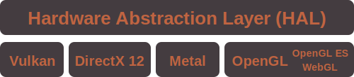

<p align="center">
  
</p>
<p align="center">
  <!--a href="https://docs.rs/gfx-hal">
      
  </a-->
  <a href="https://travis-ci.org/gfx-rs/gfx">
      
  </a>
  <a href="https://ci.appveyor.com/project/kvark/gfx">
      
  </a>
  <!--a href="https://crates.io/crates/gfx-hal">
      
  </a-->
  <a href="https://gitter.im/gfx-rs/gfx">
    
  </a>
  <br>
  <strong><a href="info/getting_started.md">Getting Started</a> | <a href="http://docs.rs/gfx-hal">Documentation</a> | <a href="http://gfx-rs.github.io/">Blog</a> </strong>
</p>

# gfx-rs

gfx-rs is a low-level, cross-platform graphics abstraction library in Rust. It consists of the following layers/components:

* `gfx-hal` which is gfx's hardware abstraction layer: a Vulkan-ic mostly unsafe API which translates to native graphics backends.
* `gfx-backend-*` which contains graphics backends for various platforms:
  * [Vulkan](src/backend/vulkan)
  * [DirectX 12](src/backend/dx12)
  * [Metal](src/backend/metal)
  * [OpenGL 2.1+/ES2+](src/backend/gl)
* `gfx-warden` which is a data-driven reference test framework, used to verify consistency across all graphics backends.

## Example

To run an example, simply use `cargo run` and specify the backend with `--features {backend}` (where `{backend}` is one of `vulkan`, `dx12`, `metal`, or `gl`). For example:

```bash
git clone https://github.com/gfx-rs/gfx
cd gfx/examples/hal
cargo run --bin quad --features vulkan
cargo run --bin compute --features dx12 1 2 3 4
```

This runs the `quad` example using the Vulkan backend, and then the `compute` example using the DirectX 12 backend.

These examples assume that necessary dependencies for the graphics backend are already installed. For more information about installation and usage, refer to the [Getting Started](info/getting_started.md) guide.

## Hardware Abstraction Layer

The Hardware Abstraction Layer (HAL), is a thin, low-level graphics layer which translates API calls to various graphics backends, which allows for cross-platform support. The API of this layer is based on the Vulkan API, adapted to be more Rust-friendly.

<p align="center"></p>

Currently HAL has backends for Vulkan, DirectX 12, Metal, and OpenGL/OpenGL ES/WebGL.

The HAL layer is consumed directly by user applications or libraries. HAL is also used in efforts such as [gfx-portability](https://github.com/gfx-rs/portability).

## pre-LL

If you are looking for information about the released crates (`gfx_core`, `gfx`, `gfx_device_*`, `gfx_window_`, etc), they are being developed and published from the [pre-ll](https://github.com/gfx-rs/gfx/tree/pre-ll) branch. Code in `master` is a complete rewrite that will be shipped in different crates.

## License

[license]: #license

This repository is licensed under either of

* Apache License, Version 2.0, ([LICENSE-APACHE](LICENSE-APACHE) or http://www.apache.org/licenses/LICENSE-2.0)
* MIT license ([LICENSE-MIT](LICENSE-MIT) or http://opensource.org/licenses/MIT)

at your option.

## Contributions

Unless you explicitly state otherwise, any contribution intentionally submitted for inclusion in the work by you, as defined in the Apache-2.0 license, shall be dual licensed as above, without any additional terms or conditions.
