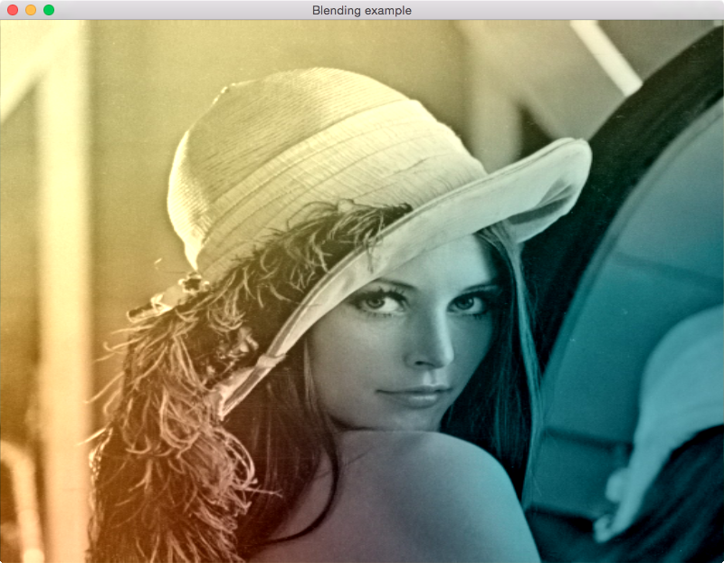

<!--
    Copyright 2014 The Gfx-rs Developers.

    Licensed under the Apache License, Version 2.0 (the "License");
    you may not use this file except in compliance with the License.
    You may obtain a copy of the License at

        http://www.apache.org/licenses/LICENSE-2.0

    Unless required by applicable law or agreed to in writing, software
    distributed under the License is distributed on an "AS IS" BASIS,
    WITHOUT WARRANTIES OR CONDITIONS OF ANY KIND, either express or implied.
    See the License for the specific language governing permissions and
    limitations under the License.
-->

# Blend Example

*Will it blend?* Blending is the process of mixing different components so
you get a final result. This example will use two images (one grayscale, one
colored) and a variety of blending equations to demonstrate both the usage of
textures, and how they can be accessed from shaders.

Use **B** to toggle between different blend equations.

All the blending equations used can be found [here](http://docs.gimp.org/en/gimp-concepts-layer-modes.html).

## Screenshot

