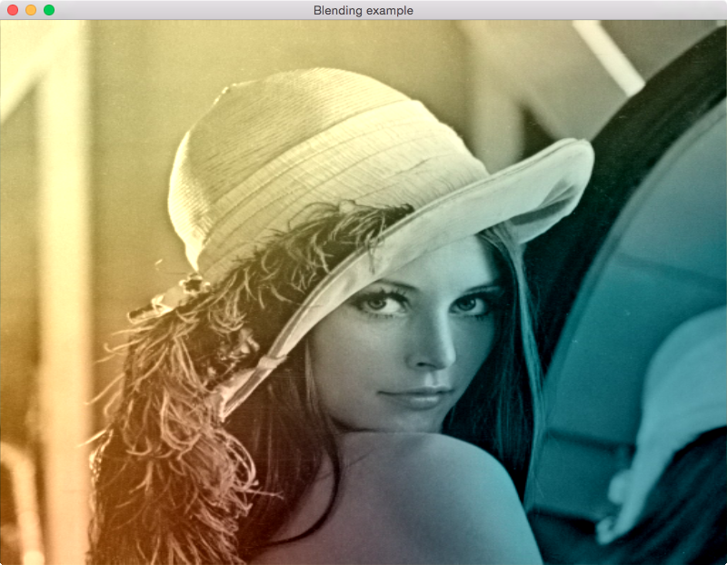

# Blend Example

*Will it blend?* Blending is the process of mixing different components so
you get a final result. This example will use two images (one grayscale, one
colored) and a variety of blending equations to demonstrate both the usage of
textures, and how they can be accessed from shaders.

Use **B** to toggle between different blend equations.

All the blending equations used can be found [here](http://docs.gimp.org/en/gimp-concepts-layer-modes.html).

## Screenshot

