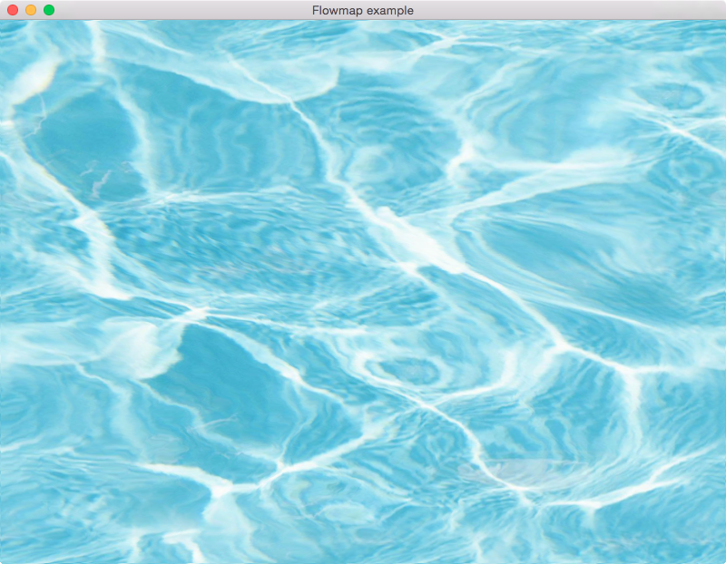

# Flowmap Example

A flowmap example. Flow mapping is often used to simulate water motion, by
encoding a flow direction using the red and green channel of an image. This
example uses three images to compose this effect:
* a flow map, which contains direction vector in the red and green channel
* a water diffuse texture, which will be distorted
* a noise texture, which fixes a common problem with flow maps mentioned in
the article *Animating Water Using Flow Maps* below

## Screenshot

## Further reading

* [Water shader from source engine](https://developer.valvesoftware.com/wiki/Water_(shader))
* [Water Flow in Portal 2 – Valve paper](http://www.valvesoftware.com/publications/2010/siggraph2010_vlachos_waterflow.pdf)
* [Animating Water Using Flow Maps – Graphics Runner](http://graphicsrunner.blogspot.se/2010/08/water-using-flow-maps.html)
* [A Walkthrough of the Special FX of Uncharted 3: Drake's Deception – Page 57](http://twvideo01.ubm-us.net/o1/vault/gdc2012/slides/Missing%20Presentations/Added%20March%2026/Keith_Guerrette_VisualArts_TheTricksUp.pdf#page.57)
* [Water flow shader – icefall games](https://mtnphil.wordpress.com/2012/08/25/water-flow-shader/)
