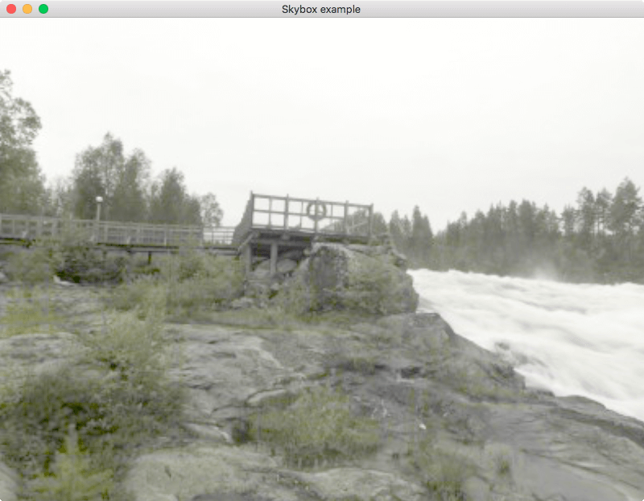

# Skybox

A small example demonstrating the use of cubemap textures. Full implementation
details [here](http://gamedev.stackexchange.com/a/60377). Cubemap textures from
Emil Persson at [humus.name](http://www.humus.name/index.php?page=Textures&ID=136).

## Screenshot

