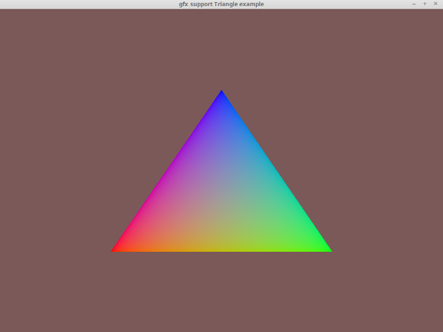

# Triangle Example

A simple example showing how to render a colored triangle using vertex and index
buffers, GLSL shaders. This is the most basic example that renders geometry,
aside from it's advanced use of 3 colors.

## Screenshot

