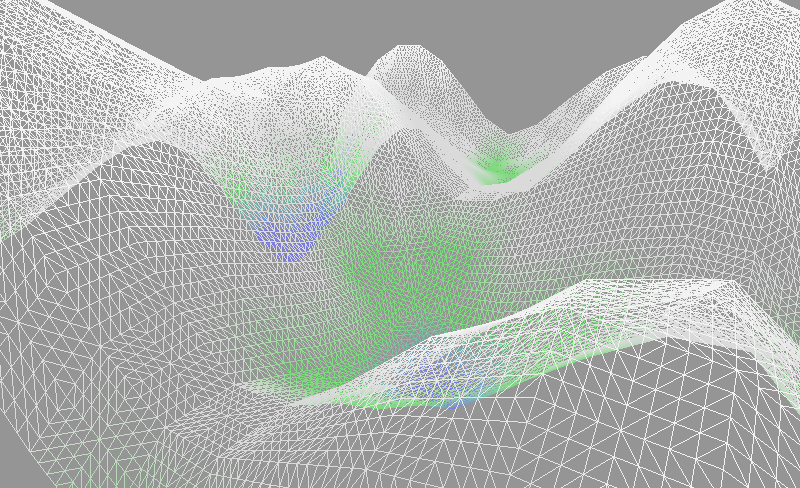

<!--
    Copyright 2014 The Gfx-rs Developers.

    Licensed under the Apache License, Version 2.0 (the "License");
    you may not use this file except in compliance with the License.
    You may obtain a copy of the License at

        http://www.apache.org/licenses/LICENSE-2.0

    Unless required by applicable law or agreed to in writing, software
    distributed under the License is distributed on an "AS IS" BASIS,
    WITHOUT WARRANTIES OR CONDITIONS OF ANY KIND, either express or implied.
    See the License for the specific language governing permissions and
    limitations under the License.
-->

# Terrain Example

A simple procedural terrain example. This should generate a landscape using
Perlin Noise, and scatter some entities around - for example houses and trees.
This will demonstrate the initialisation of buffers and shaders, and how the
library can be composed with other external dependencies.

## Screenshot

## Useful libraries

- [glfw-rs](https://github.com/bjz/glfw-rs)
- [cgmath-rs](https://github.com/bjz/cgmath-rs)
- [noise-rs](https://github.com/bjz/noise-rs)
- [color-rs](https://github.com/bjz/color-rs) (could use some work)

## Images of possible output

_Sourced from [voyager3.tumblr.com](http://voyager3.tumblr.com/)_

