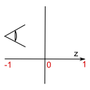
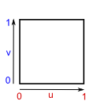

# gfx-backend-gl

[OpenGL](https://www.khronos.org/opengl/) backend for gfx.

## Normalized Coordinates

Render | Depth | Texture
-------|-------|--------
 |  | 

## GLSL Mirroring

Texture Kind | GLSL sampler
-------------|-------------
`D1` | *g*sampler1D, sampler1DShadow
`D1Array` | *g*sampler1DArray, sampler1DArrayShadow
`D2` | *g*sampler2D, *g*sampler2DMS, sampler2DShadow
`D2Array` | *g*sampler2DArray, *g*sampler2DMSArray, sampler2DArrayShadow
`D3` | *g*sampler3D
`Cube` | *g*samplerCube, samplerCubeShadow
`CubeArray` | *g*samplerCubeArray, samplerCubeArrayShadow

Buffer resource views are seen as *g*samplerBuffer.

Rust basic type | GLSL (1.3 and above)
----------------|---------------------
i32 | int
u32 | uint
f32 | float
f64 | double
