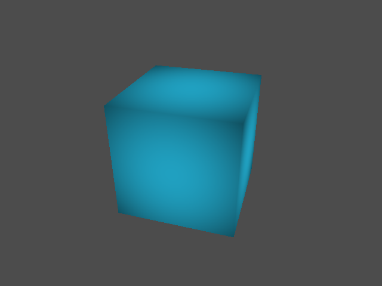

<!--
    Copyright 2014 The Gfx-rs Developers.

    Licensed under the Apache License, Version 2.0 (the "License");
    you may not use this file except in compliance with the License.
    You may obtain a copy of the License at

        http://www.apache.org/licenses/LICENSE-2.0

    Unless required by applicable law or agreed to in writing, software
    distributed under the License is distributed on an "AS IS" BASIS,
    WITHOUT WARRANTIES OR CONDITIONS OF ANY KIND, either express or implied.
    See the License for the specific language governing permissions and
    limitations under the License.
-->

# Cube Example

A simple example showing how to render a textured cube using vertex and index
buffers, GLSL shaders, and uniform parameters. It is also using cgmath-rs to
compute the view-projection matrix.

The example provides two versions of each shader: for GLSL 1.20 and 1.50-core.
This is needed for proper OSX compatibility and ensures it can run on any
system.

## Screenshot

